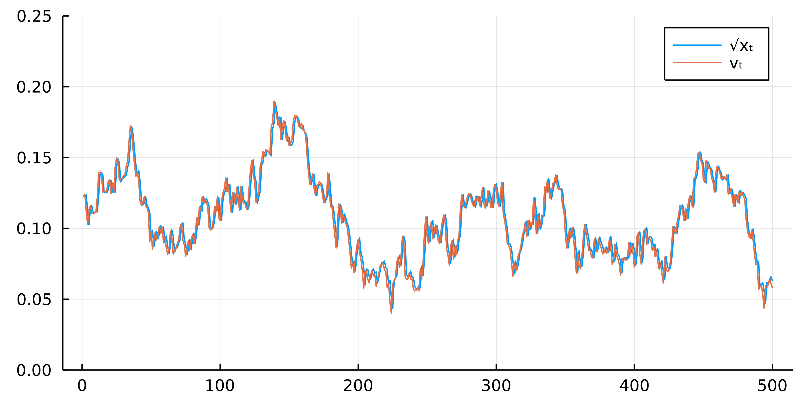

# OptionModels-cKF-ccf

This repository illustrates and provides code for the estimation procedure developed in the paper **Estimating Option Pricing Models Using a Characteristic Function-Based Linear State Space Representation** written by Peter Boswijk, Roger Laeven and Evgenii Vladimirov. 

# Simulated data

The illustration is based on simulated data from three popular option pricing models: SV, SVJ and SVCDEJ. The simulated data are stored as csv files in `models`. The state vectors are simulated using an Euler discretization and the option prices are computed using the COS method. The option prices are then distorted with additive errors. For all simulation details see Section 4 of the paper. 

# Code

The code is written in `Julia` version 1.7. The dependency packages are listed in `Project.toml`. 

For each of the three models, the example code in `*_example.jl`: 
* reads the simulated options data
* calculates the option-implied CCF and corresponding covariance matrices
* estimates the model parameters based on the QML and collapsed KF
* plots the filtered volatility next to the true process and saves the figures

The filtering and estimation procedures are described in Section 3 of the paper. 

# Illustration

The figure below is an output of `SV_example.jl`, that is, it plots the filtered volatility based on the estimated parameters of the SV model next to the true stochastic volatility process. The filtering examples for the other models are in `models` subfolders.

