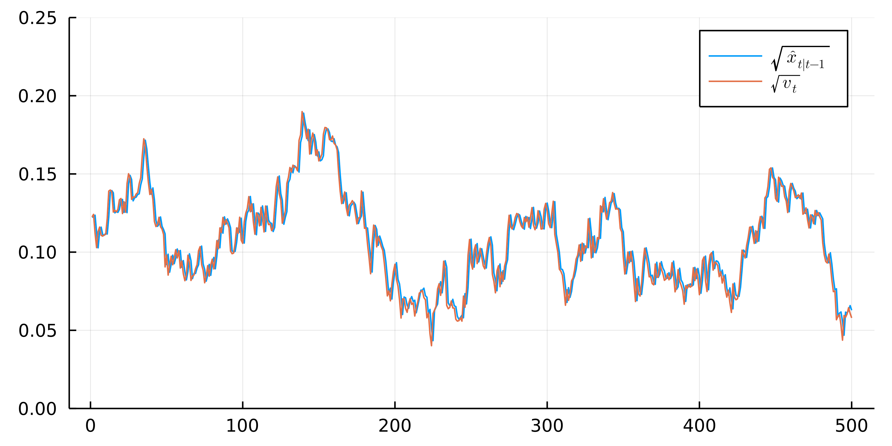

# OptionModels-cKF-ccf
This repository illustrates the estimation procedure from the paper **Estimating Option Pricing Models Using a Characteristic Function-Based Linear State Space Representation** based on the simulated data.

